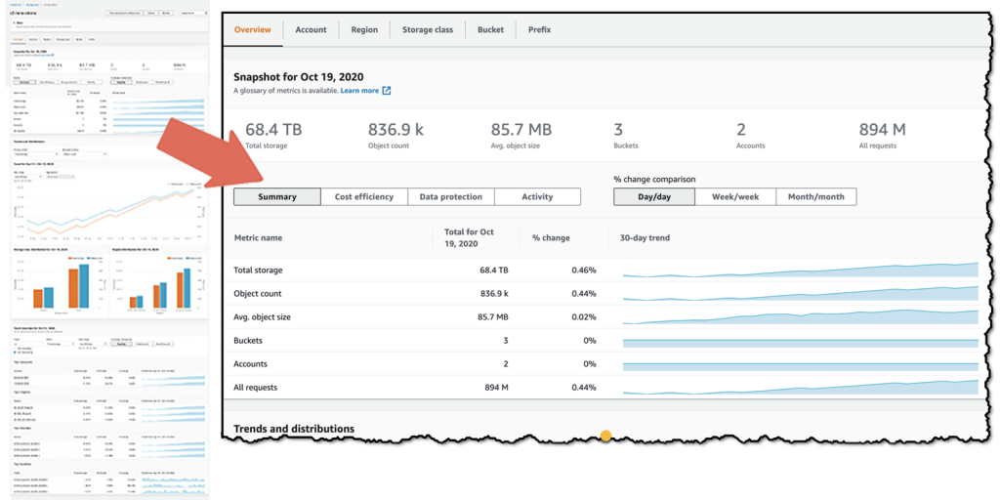

By Corey Gale, Senior Engineering Manager @ GumGum


## Introduction

For organizations that deploy their production systems to the cloud, bills from their cloud providers are often the 3rd most expensive cost to the business, right after labor and office space. But unlike those other two expenditures, companies tend to spend very little time understanding and optimizing their cloud bills. I think this is due to two main reasons: billing is complicated and predicting usage requires deep knowledge of both the business and its systems.

While this sounds like a hard problem to solve (and it is!) I think it also creates a great opportunity for engineers to lay the groundwork for understanding and optimizing their company's cloud spend. And the more complete your bird's-eye view, the easier it is to understand cost growth and optimization trade-offs. From Finance's perspective, this type of expertise is invaluable and can be used to enable cost saving projects that require significant cash investments up-front.

In this article I'm going to walk you through my experience managing AWS costs at GumGum. It has three distinct stages: tracking and understanding costs, using those insights to reduce costs and the risk of making cost-saving changes, and then integrating these cost insights into our processes. I've spent nearly two years developing this process, and it has lead to savings in the millions of dollars per year.

## Stage 1: Track Cost

As I mentioned earlier, billing is complicated. To illustrate my point, consider the pricing for one of AWS's most popular offerings: the infamous Application Load Balancer. According to [AWS's docs](https://aws.amazon.com/elasticloadbalancing/pricing/){:target="_blank"}, ALBs cost:

> $0.0225 per ALB-hour + $0.008 per LCU-hour

What's a LCU-hour, you ask? It depends. AWS considers 4 different metrics:

> 1. **New connections:** the number of newly established connections per second. Typically, many requests are sent per connection.
2. **Active connections:** the number of active connections per minute.
3. **Processed bytes:** the number of bytes processed by the load balancer in Gigabytes (GB) for HTTP(S) requests and responses.
4. **Rule evaluations:** the product of the number of rules processed by your load balancer and the request rate.

Every hour, AWS calculates the max of those 4 metrics and that becomes your LCU-hour cost. Then you add the ALB-hour cost. Easy, right? /s

It's a similar story for many other AWS services, which is why I suggest investing time into measuring actual usage rather than trying to predict it. To start measuring, the first thing you need to do is **tag everything**. Establish a tagging system, apply it and stick to it. At GumGum, we require 3 tags on all resources: `Billing` (cost center), `Owner` (email for contact) and `Name`. If you want to ensure process compliance in your organization, consider setting up notifications for improperly tagged resources, or even automatic deletion of untagged resources (Lambda on a cron is great for this).

Once you have a tagging system in place, the next thing you need to do is [activate user-defined cost allocation tags.](https://docs.aws.amazon.com/awsaccountbilling/latest/aboutv2/activating-tags.html){:target="_blank"} Then you can [setup CUR](https://docs.aws.amazon.com/cur/latest/userguide/cur-create.html){:target="_blank"} (current usage reporting), which will dump very verbose billing data into a S3 bucket with hourly granularity for every charge on every resource in every account. Each charge also includes each of the cost allocation tags you previously enabled, which will make subsequent querying much easier.

### **Budgets**

Setup [AWS Budgets](https://aws.amazon.com/aws-cost-management/aws-budgets/){:target="_blank"} according to `Billing` tags, for example. While budgets are trivial to setup for a well-tagged account, be aware of the added overhead, especially when increased costs are expected when considering factors like increased traffic or decreased spot instance availability.

### **Basic reporting**

Having CUR data available in S3 opens up a lot of possibilities. In the AWS universe, there are two services available for querying and visualizing your data: Athena and QuickSight.

Athena is great for making ad hoc queries of your newly-minted CUR data in S3. It's quick to setup ([here's an AWS tutorial](https://aws.amazon.com/blogs/aws-cost-management/querying-your-aws-cost-and-usage-report-using-amazon-athena/){:target="_blank"} for setting up both Glue and Athena) and makes integrating your AWS cost data into external systems simple since Athena offers a SQL DB connection. Although query performance can be slow for larger timespans and writing queries can be tricky for those not well-versed in SQL, Athena is a very powerful tool that can answer virtually any question you may have about your AWS spend.

Here are some example queries I have found to be particularly useful:

- Hourly breakdown of Spot and On-Demand usage:

    ```sql
    SELECT "line_item_usage_start_date" AS "usagestartdate", 
           Sum(CASE 
                 WHEN "line_item_usage_type" NOT LIKE '%Spot%' 
                      AND "line_item_usage_type" LIKE '%Box%' THEN Cast( 
                 "line_item_blended_cost" AS DOUBLE) 
                 ELSE 0.0 
               END)                     AS "On Demand", 
           Sum(CASE 
                 WHEN "line_item_usage_type" LIKE '%Spot%' THEN Cast( 
                 "line_item_blended_cost" AS DOUBLE) 
                 ELSE 0.0 
               END)                     AS "Spot" 
    FROM   "hourly_cost_report" 
    GROUP  BY "line_item_usage_start_date" 
    ORDER  BY "line_item_usage_start_date" ASC;
    ```

- Data transfer by resource ID:

    ```sql
    SELECT "line_item_product_code", 
           "line_item_usage_type", 
           "product_from_location", 
           "product_to_location", 
           "line_item_resource_id", 
           Sum("line_item_usage_amount") / 1024 AS "TBs", 
           Sum("line_item_unblended_cost")      AS "Cost" 
    FROM   "hourly_cost_report" 
    WHERE  "line_item_usage_type" LIKE '%Bytes%' 
           AND ( "line_item_usage_type" LIKE '%In%' 
                  OR "line_item_usage_type" LIKE '%Out%' 
                  OR "line_item_usage_type" LIKE '%Nat%' 
                  OR "line_item_usage_type" LIKE '%Regional%' ) 
    GROUP  BY "line_item_product_code", 
              "line_item_usage_type", 
              "product_from_location", 
              "product_to_location", 
              "line_item_resource_id" 
    ORDER  BY Sum("line_item_unblended_cost") DESC;
    ```

- Data storage and transfer costs for each S3 bucket:

    ```sql
    SELECT "line_item_product_code", 
           "line_item_usage_type", 
           "line_item_resource_id", 
           Sum(CASE 
                 WHEN "line_item_usage_type" LIKE '%Byte%' THEN 
                 "line_item_usage_amount" / 1024 
                 ELSE "line_item_usage_amount" 
               END)                      AS "Usage", 
           CASE 
             WHEN "line_item_usage_type" LIKE '%Byte%' THEN 'TBs' 
             ELSE 'Requests' 
           END                           AS "Usage Units", 
           Sum("line_item_blended_cost") AS cost 
    FROM   "hourly_cost_report" 
    WHERE  "product_product_name" = 'Amazon Simple Storage Service' 
    GROUP  BY "line_item_product_code", 
              "line_item_usage_type", 
              "line_item_resource_id" 
    ORDER  BY Sum("line_item_blended_cost") DESC;
    ```

- Cost of all EC2 resources for certain `Billing` tags, for the current month, broken down by tag:

    ```sql
    SELECT resource_tags_user_billing     AS BillingTag, 
           Sum(line_item_blended_cost 
               + discount_total_discount) AS Cost 
    FROM   "hourly_cost_report" 
    WHERE  line_item_product_code = 'AmazonEC2' 
           AND month = Cast(Month(CURRENT_DATE) AS VARCHAR(4)) 
           AND year = Cast(Year(CURRENT_DATE) AS VARCHAR(4)) 
           AND resource_tags_user_billing IN ( 'ie-ad-server', 
                                               'jp-ad-server', 
                                               'or-ad-server', 
                                               'va-ad-server' ) 
    GROUP  BY resource_tags_user_billing, 
              bill_billing_period_start_date 
    ORDER  BY bill_billing_period_start_date;
    ```

If you don't plan on ingesting and visualizing your AWS CUR data using an external tool, Amazon QuickSight is a good, low-cost option. To setup a QuickSight dashboard for your CUR data, follow [this tutorial from AWS](https://aws.amazon.com/premiumsupport/knowledge-center/quicksight-cost-usage-report/){:target="_blank"}.  

### **Advanced reporting**

If you plan to ingest your CUR data into your existing data warehouses (like Snowflake, for example), you will gain the ability to join and correlate your AWS cost data with your business data, which can unlock a whole new wave of insights. At GumGum, I collaborated with our BI team (special shout-out to [Ruchi Singh](https://www.linkedin.com/in/ruchi-singh-68015945/){:target="_blank"}) to merge our traffic metrics with our CUR data and we created per-region, per-revenue-stream cost metrics in Looker.

As we're a digital advertising company, it made sense to report our metrics in the form of CPM (cost per 1000 impressions). And while CPM served as a great metric for overall cost efficiency, we ran into situations where a changing CPM didn't warrant any follow-up actions, increasing noise. For example, during periods of poor spot instance availability, our EC2 costs increased due to using more costly on-demand instances. In these situations, the increase in CPM was expected. To combat this noise, we created a second metric: IHPM (instance hours per 1000 impressions). Recall the U in CUR: usage! CUR data also includes usage data right next to cost, so summing up instance hours is just as easy as cost. With this new metric in place, we were able to analyze our efficiency in terms of CPU cycles, which didn't change when compute capacity costs did. We could then more critically scrutinize this new IHPM metric - if IHPM increased, either our code got less performant or its supporting infrastructure got less efficient. In either case, a further investigation is always warranted.


## Stage 2: Reduce Cost

Now that you have your costs tracked (whether it be via CUR data or Cost Explorer), you can start optimizing your workloads to reduce cost without noticeably impacting performance.

### Right-size your workloads and tune auto-scaling

First, before doing any capacity planning, you need to right-size your workloads. Don't commit long-term to capacity for workloads that aren't tuned! Right-sizing means adjusting your application and its infrastructure such that you can consistently utilize a large proportion of your limiting resource(s), which for a lot of applications these days is CPU or network IO. A perfectly right-sized application will run with no wasted resources. To accomplish this, you will need to make use of all resource utilization monitoring you have available. CloudWatch and Prometheus are excellent for this.

Here are some of the most common ways we right-size workloads at GumGum:

1. Optimize Kubernetes pod requests and limits. If an application's initialization process had a different resource footprint than the long-term running process, we moved those processes to their own [`initContainer`](https://kubernetes.io/docs/concepts/workloads/pods/init-containers/){:target="_blank"} which get their own requests/limits. Example: database migrations and cache prepopulations.
2. Tune auto-scaling to reduce headspace (excess resources left on worker nodes).
    - Protip: use percentiles in your auto-scaling thresholds, hard-coding a count will add overhead as it will likely need to be re-tuned in the future.
3. Choose instance families that align with the application's limiting resource. This sounds obvious, but AWS is always adding new instance types with new ratios of all resources. It's good form to reconsider instance families over time, especially since resource footprints tend to evolve along with their applications.
4. For asynchronous workloads, we tune batch sizes to maximize CPU utilization. We also make sure auto-scaling is based on queue depth and that it doesn't overreact to surges in new messages. [Thrashing](https://en.wikipedia.org/wiki/Thrashing_(computer_science)){:target="_blank"} is expensive!
5. Rewrite application `Dockerfile`'s to use [multi-stage builds](https://docs.docker.com/develop/develop-images/multistage-build/){:target="_blank"}. This reduces the resulting Docker image size since only the required binaries are included, which also helps improve [bin-packing](https://en.wikipedia.org/wiki/Bin_packing_problem){:target="_blank"}.

### Use cheaper capacity

Now that your workloads are right-sized, the next step is to adjust them to use the cheapest capacity possible. For EC2-backed systems, you should first consider **spot instances** as they are typically the cheapest form of compute available (they are up to 90% cheaper than equivalent on-demand instances). Spot instance prices are based on the spot market, which is controlled by Amazon who considers instance availability and demand to calculate the current spot instance prices. If spot instance availability decreases (like when Amazon has less spare capacity), spot prices will increase and if your bid price is below the new spot market rate, your instance will get terminated (with a 2 minute warning). For workloads that are stateless and can gracefully handle instance replacements, spot instances offer a great way to drastically reduce your compute spend.

- Tip: managing spot instance lifecycles can be complicated. At first, consider using managed services like [Spot.io](https://spot.io){:target="_blank"} to handle your spot instances for you. Spot.io has some great features like automatic fallback to on-demand instances and scaling strategies that pick instances with the best availability.

In many cases (like hosting a database), spot instances might not make sense. In those situations the next cheapest capacity to consider is **Reserved Instances** (RIs). RIs allow you to reserve capacity of a certain instance family for 1 or 3 years in exchange for a discount of up to 72%. Discount amounts depend mostly on term, but also the amount of money you are willing to spend upfront (0-100% of the total cost). If you want a little bit of extra flexibility, you can sacrifice 6-9% of discount and get convertible RIs instead. This class of RIs allow you to exchange instance families (example: convert C5 to M5), ensuring unused reservations can be repurposed elsewhere (assuming such a need exists).

This brings us to the Reserved Instance Marketplace, an Amazon platform that supports the buying and selling of AWS customers' unused RIs. Should you ever end up in a situation where you have underutilized reservations, you can recoup some of your losses by [selling your excess capacity on the RI Marketplace](https://docs.aws.amazon.com/AWSEC2/latest/UserGuide/ri-market-general.html){:target="_blank"}. On the flip-side, this marketplace also tends to have some great deals on reservations, often with remaining terms of under 1 year (think short-term RIs).

If Reserved Instances don't work for you, or for a certain subset of your workloads, another way to get cheaper capacity is to use **Savings Plans** to commit to a certain hourly on-demand spend for 1 or 3 years in return for a discount of 20-50%. The Compute Savings Plan is especially flexible as it covers on-demand spend from EC2, Lambda and Fargate.

[Discount EC2 capacities compared](https://www.notion.so/b72d3848d9dc4c64912c4259b18c792d){:target="_blank"}

### Reserve capacity for managed services

Reservations don't only apply to EC2, you can also reserve capacity for the following services by making 1 or 3 year capacity commitments, some of which require upfront fees. Chances are, many of your databases aren't going away anytime soon - consider reserving them!

- [RDS DB instances](https://docs.aws.amazon.com/whitepapers/latest/cost-optimization-reservation-models/amazon-rds-reserved-db-instances.html){:target="_blank"} (up to 69% savings)
- [ElastiCache nodes](https://docs.aws.amazon.com/whitepapers/latest/cost-optimization-reservation-models/amazon-elasticache-reserved-nodes.html){:target="_blank"} (up to 55% savings)
- [Elasticsearch Service Instances](https://docs.aws.amazon.com/whitepapers/latest/cost-optimization-reservation-models/amazon-elasticsearch-service-reserved-instances.html){:target="_blank"} (up to 35% savings)
- [Redshift nodes](https://docs.aws.amazon.com/whitepapers/latest/cost-optimization-reservation-models/amazon-redshift-reserved-nodes.html){:target="_blank"} (up to 76% savings)
- [DynamoDB read/write capacity](https://docs.aws.amazon.com/whitepapers/latest/cost-optimization-reservation-models/amazon-dynamodb-reservations.html){:target="_blank"} (up to 76% savings)

### Use more cost-efficient tech

Now that your workloads are right-sized and running on the cheapest capacity, you can start tweaking your infrastructure to reduce cost even further. To start, get to know your data transfer costs. At GumGum, data transfer is the second most expensive component of our AWS bill, right after EC2 instances. To reduce our data transfer costs, I've seen 3 common strategies emerge:

1. Setup [VPC endpoints](https://docs.aws.amazon.com/vpc/latest/privatelink/vpc-endpoints.html){:target="_blank"}: easy to setup, VPC endpoints ensure traffic between your VPC and the other service does not leave the Amazon network. VPC endpoints are currently available for S3 and DynamoDB, and for other services you can use [PrivateLink](https://aws.amazon.com/privatelink/?privatelink-blogs.sort-by=item.additionalFields.createdDate&privatelink-blogs.sort-order=desc){:target="_blank"}.
2. Avoid NAT gateways for internet-heavy instances by assigning them public IPs (don't forget to ensure your security groups prevent unauthorized access).
3. Enable traffic compression: do you know if your services speak [gzip](https://developer.mozilla.org/en-US/docs/Web/HTTP/Headers/Content-Encoding){:target="_blank"}?

Our next largest cost at GumGum is S3. Again, understanding your usage patterns will be your best weapon here. To get a global view of your S3 usage and cost efficiency, I recommend you set up a [Storage Lens](https://aws.amazon.com/blogs/aws/s3-storage-lens/){:target="_blank"} dashboard. It just takes a few clicks in the AWS console to set up and can even provide actionable recommendations. Another handy tool to get familiar with is [S3 analytics](https://docs.aws.amazon.com/AmazonS3/latest/userguide/analytics-storage-class.html){:target="_blank"} which provides insights into per bucket data access patterns and makes [optimizing storage tiers](https://aws.amazon.com/s3/cost-optimization/){:target="_blank"} much more trivial.



Did you know there are 6 different [S3 bucket storage classes](https://aws.amazon.com/s3/storage-classes/){:target="_blank"}? By default, S3 buckets use the standard class which is $0.023/GB-month whereas infrequent access can be as cheap as $0.01/GB-month. And if you don't need immediate access to your files (example: backups or data for potential future audits), you can consider the Glacier Deep Archive class which is as cheap as $0.00099/GB-month.

Another significant cost for a lot of businesses is EBS volumes. This is yet another situation where you need to understand your workload's resource appetite to pick the volumes that best suit your use case. To pick an EBS volume type, you first need to decide if your priority is IOPS or throughput. For random disk access, SSDs are great (`gp2`, `gp3` , `io1`, `io2`) and for longer, sequential reads HDDs (`st1` , `sc1`) are best. 

- Tip: if your systems today depend on `gp2` volumes, especially if they have excessive storage to increase volume throughput, you should consider migrating to `gp3` volumes. `gp3` volumes are 20% cheaper and allow you to scale I/O independently of volume size.

Lastly, depending on the complexity of your software stacks, a migration of your builds to output ARM binaries can open up a whole new world of savings. ARM architecture is booming and companies like Amazon and Apple already have their own custom ARM-based silicon that deliver next-generation cost-to-performance ratios. Amazon calls theirs [Graviton processors](https://aws.amazon.com/ec2/graviton/){:target="_blank"} which are already available in multiple instance families (look for a "g" in the name) and provide up to 40% better price performance over comparable x86-based instances.

### Negotiate contracts for cheaper rates

Don't accept sticker price, especially if your monthly spend is consistently $10k or more. Reach out to AWS and negotiate agreements that allow your business to commit to a certain usage level or overall spend in return for reduced rates. While I can't disclose the specifics of GumGum's situation, I have heard of three common types of agreements: the Enterprise Discount Plan (EDP), data transfer out (DTO) agreements and private pricing for specific services like CloudFront or S3. Whatever your usage, I can attest that Amazon is more than willing to work with you, so get the conversation started if you haven't already!

In the case of the EDP, this agreement can be a little more complex. It requires the business to enroll in Enterprise support which costs a minimum of $15k/month. EDPs are typically 3 year agreements with annual spend commits and in return you get a flat percentage savings across the board for all services. You can also work proof of concept ("PoC") credits into the EDP deal which enables your business to test Amazon services on [Jeff Bezos](https://en.wikipedia.org/wiki/Jeff_Bezos){:target="_blank"}, all you need to do is talk to your account manager and fill in a little paperwork. In return you will typically get enough credit to test full-scale workloads on new AWS services. This is a great way to validate new cost-savings projects that are riskier in terms of spend and can help you avoid conversations with your boss that start with "so we spent $50k yesterday finding out why WAF's billing doesn't fit our traffic patterns".

### Re-architect your systems

Architecting your systems to be more cost efficient is one of the best ways to truly minimize its costs. In many cases, making these changes will not only enable new cost-saving abilities, but they can also improve overall system stability since ephemerally-minded hosts operate with stricter expectations. At GumGum, we've completed a number of re-architecture projects with the primary driving force being cost-savings. Sometimes this meant tweaking our systems and other times it meant migrating our workloads to completely new technologies that offered a more favorable cost:benefit ratio for the business.

In no particular order, here are some tips to consider when re-architecting your systems to enable cost-saving efficiencies later:

- Whenever possible, make your application stateless. Ideally, none of your application state should reside in a particular server instance. In situations where local state is required, the amount of state should be minimized to make persisting machine state during termination as quick as possible.
    - Why? Enables easy adoption of spot instances and makes your application less [monolithic](https://en.wikipedia.org/wiki/Monolithic_application){:target="_blank"}. Also makes scaling in/out easier and faster (no pre-warming or worrying about local resource usage).
- When using spot instances, one of the most challenging things to get right is handing spot instance terminations. To handle those properly, you need to listen to the instance's event lifecycle for spot termination signals. This will give you advanced notice of your instance being marked for termination which allows you to gracefully drain connections and persist any remaining state, reducing or eliminating user impact.
    - Tip: to reduce the up-front engineering effort required to use spot instances, consider using a third party service like [Spot.io](https://spot.io){:target="_blank"}.
- If your workload has a resource footprint that resembles that of two or more separate processes, decouple them! Monoliths that have complex resource requirements are harder to scale and resource utilization is much harder to make constant. As a result, more headspace is needed which increases waste. In some situations, "planning for the worst" resulted in 50% of the CPU being wasted - don't let yourself fall in that trap!
- Believe it or not, some vendors help you with cost reduction! Check out their customer service portals and APIs to see what data and tools are available for you to better understand and optimize cost. In GumGum's case, we found [this Looker integration by Snowflake](https://looker.com/platform/blocks/source/cost-and-usage-analysis-by-snowflake){:target="_blank"} to be very helpful.
- Containerizing an application enables it to run in more environments. Unless your application has a certain geographical requirement, having the ability to run your app in the region with the cheapest capacity will increase savings and maximize spot instance availability.
- Cash-in on caching ™️: if the same data is being requested over and over, consider caching it! ElasticCache is great for this (hosted redis and memcached). If you use DynamoDB, setting up [DAX as a pass-through cache](https://aws.amazon.com/blogs/database/amazon-dynamodb-accelerator-dax-a-read-throughwrite-through-cache-for-dynamodb/){:target="_blank"} is easy and can quickly reduce the overall traffic your actual DynamoDB tables see.
    - To determine if caching is necessary, start by understanding the volume of repeated requests made to your service. If significant, compare cached vs non-cached request costs. In many cases, adding a cache may not make sense given the upfront costs to implement and the ongoing costs to operate.

## Stage 3: Include Cost In Your Process

To ensure cost optimization remains front-of-mind and scales with your organization, you need to start including it in your process. From my experience at GumGum, incorporating cost into our process has had a higher ROI than both Stages 1 and 2 combined. Not only have we identified numerous cost-saving opportunities, we've also armed engineers with data on the costs of their systems in production that they can police with the context of their changes.

The main control loop we use to drive cost-saving initiatives is a bi-weekly meeting that is attended by representatives from each engineering team and our SVP of Engineering. At this meeting we keep an eye on overall AWS spend, discuss capacity planning and new tools/techniques to reduce cost. Here's the agenda we use for that meeting:

Cost Control Meeting Agenda

1. Review action items from the last meeting
2. Review cost savings updates
3. Capacity changes (like a system decommissioning or new traffic bumps)
5. Review custom cost dashboards (CloudWatch and Looker)
4. Review [Savings Plans Utilization Report](https://console.aws.amazon.com/cost-management/home#/ri/utilization){:target="_blank"} and [RI Utilization Report](https://console.aws.amazon.com/cost-management/home#/ri/utilization){:target="_blank"}
5. Review custom cost dashboards (CloudWatch and Looker)
6. Review reports/detections from [AWS Cost Anomaly Detection](https://aws.amazon.com/aws-cost-management/aws-cost-anomaly-detection/){:target="_blank"}
7. Review [S3 Storage Lens dashboard](https://aws.amazon.com/blogs/aws/s3-storage-lens/){:target="_blank"} (and individual [bucket Storage Class Analysis metrics](https://docs.aws.amazon.com/AmazonS3/latest/userguide/analytics-storage-class.html){:target="_blank"})
8. Discuss new tools and strategies to reduce cost

## Conclusion

As you can see, managing costs for your company's cloud is complicated, time-consuming and growing in complexity as new services and products are released every day (AWS re:Invent alone had 146 announcements this past year). To effectively manage cost, you need to develop a system to track costs and identify optimization opportunities. You also need to make sure your applications are running on the cheapest capacity possible - whether that be by using cheaper instances or reserved capacity. Finally, you need to update your processes to ensure cost is considered on a regular basis. One way to do this, is by empowering engineers with new tools that give them insights into the true costs of their systems in production. Another, is by hosting a meeting to police spend and enable collective bargaining (capacity planning).

TL;DR: tag everything, use the cheapest capacity, constantly consider impacts on cost


*Article version: 1.0.0*
